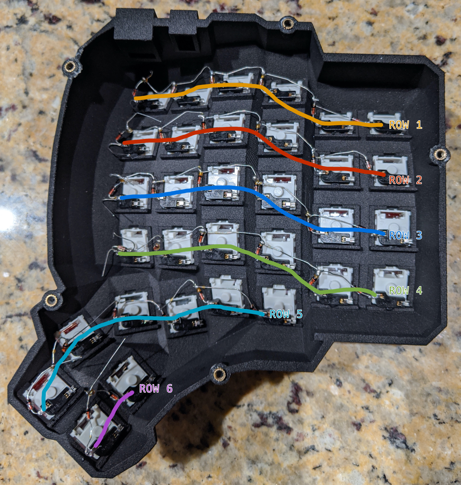
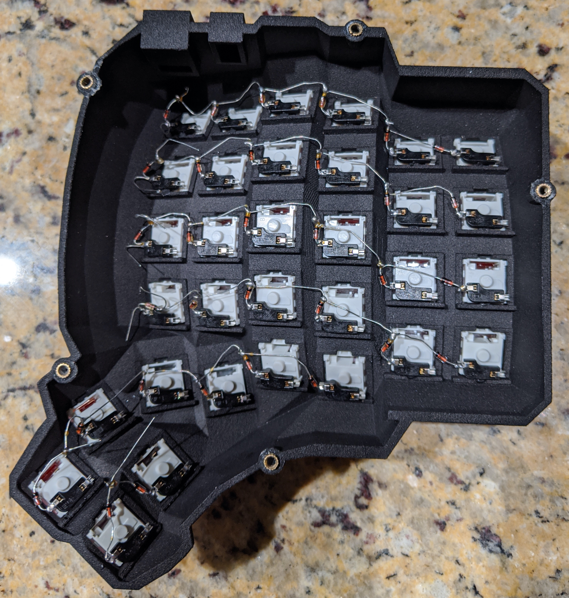
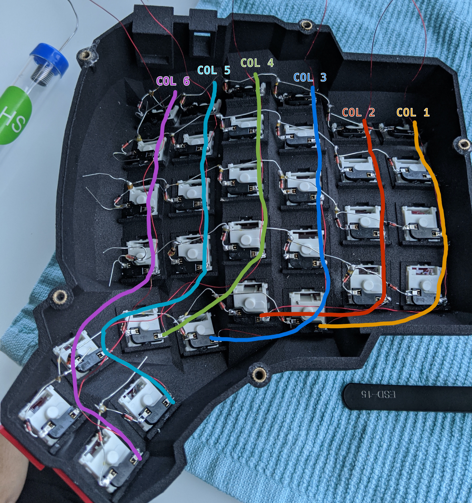
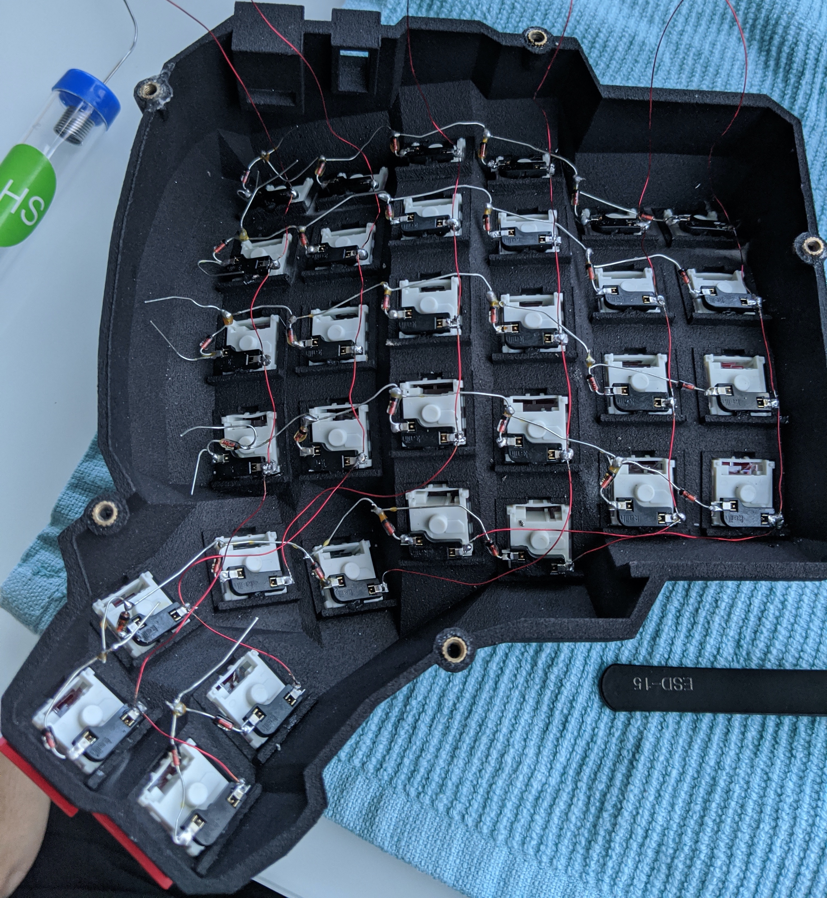
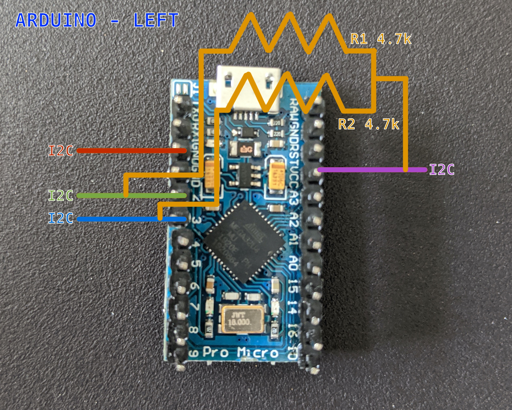
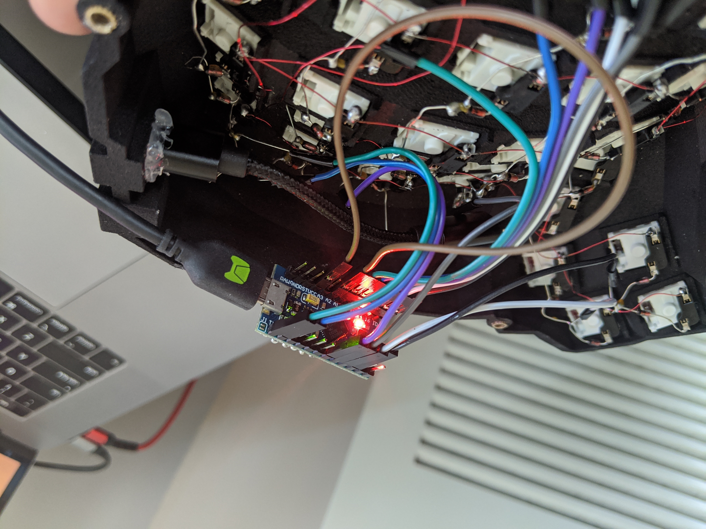

# My Dactyl-ManuForm Keyboard

This is a fork of the [Dactyl](https://github.com/burabure/dactyl-keyboard), a parameterized, split-hand, concave, columnar, ergonomic keyboard with some custom tweaks done by @burabure:

- added kailh switch support and kailh hot swap socket cradles for every switch.
- added 3d printable wrist rests
- added 3d printable bottom plates

you can find ready to print files on the [things directory](https://github.com/aotarola/dactyl-keyboard/blob/master/things/)


## Assembly

### Printing

Pregenerated STL files are available in the [things/](things/) directory.

This model can be tricky to print, but I printed @ home with my cheap ender 3 printer (calibration is key).
If printed at Shapeways or other professional shops, I would not expect any problems.

I reccomend that you print a couple [switch holes](things/switch-hole.stl) to test your switches fit before printing the whole keyboard.
The fit should be thight and the switch hole should flex a little, but not deform. if the fit is not right, you'll have to change the `keyswitch-height` and `keyswitch-width` and regenerate the desings (see [Generating a Design](#generating-a-design))

### Materials

Here are materials I used for the build:

- 2 x [Pro Micro ATmega32U4 5V/16MHz](https://www.amazon.com/gp/product/B01HCXMBOU/ref=ppx_yo_dt_b_asin_title_o05_s00?ie=UTF8&psc=1)
- [30 AWG Magnet Wire](https://www.amazon.com/BNTECHGO-AWG-Magnet-Wire-Transformers/dp/B07GBMKMKY/ref=sr_1_13?dchild=1&keywords=30+awg+wire&qid=1593643486&sr=8-13)
- [Jumper Wires](https://www.amazon.com/gp/product/B01EV70C78/ref=ppx_yo_dt_b_asin_title_o04_s00?ie=UTF8&psc=1)
- [1N4148 Switching Diode 100V 200mA Hole DO-35](https://www.amazon.com/McIgIcM-1n4148-switching-Standard-Through/dp/B06XB1R2NK/ref=sr_1_3?dchild=1&keywords=1N4148+diodes&qid=1593644189&sr=8-3)
- [M3 x 3 mm Female Thread Brass Knurled Threaded Insert](https://www.amazon.com/gp/product/B01IYWTCWW/ref=ppx_yo_dt_b_asin_title_o02_s00?ie=UTF8&psc=1)
- [M3x4.8mm Flat Phillips Head Screw](https://www.amazon.com/uxcell-Computer-M3x4-8mm-Phillips-200pcs/dp/B01N3ZG5OM/ref=sr_1_3?dchild=1&keywords=M3+screws+5mm&qid=1593643935&sr=8-3)
- [4P4C x 2 Female Telephone Connector](https://www.amazon.com/gp/product/B07S48FL5H/ref=ppx_yo_dt_b_asin_title_o02_s00?ie=UTF8&psc=1)
- [Phone Reciever RJ9 Coiled Cable](https://www.amazon.com/gp/product/B07CJ8SVB4/ref=ppx_yo_dt_b_asin_title_o02_s00?ie=UTF8&psc=1)
- [USB 2.0 A-Male to Micro B](https://www.amazon.com/gp/product/B0719H12WD/ref=ppx_yo_dt_b_asin_title_o02_s00?ie=UTF8&psc=1)
- [Straight Solder Type A USB Female Jack Connector](https://www.amazon.com/gp/product/B0094DXENY/ref=ppx_yo_dt_b_asin_title_o01_s00?ie=UTF8&psc=1)
- [1U Blank DSA Keycaps](https://www.amazon.com/-/es/gp/product/B07VT7JP8Q/ref=ppx_yo_dt_b_asin_title_o04_s00?currency=USD&ie=UTF8&language=en_US&psc=1)
- [2x 4.7K Ohm Resistors](https://www.amazon.com/gp/product/B07QJB3LGN/ref=ppx_yo_dt_b_asin_title_o07_s00?ie=UTF8&psc=1)
- [USB 2.0 A Male to A Male](https://www.amazon.com/Monoprice-Transfer-Enclosures-Printers-Cameras/dp/B002KKXP3M/ref=sr_1_7?dchild=1&keywords=usb+a+to+usb+a&qid=1593642770&sr=8-7)
- Switches (64, but you should get more just in case), I used [Hako Violet](https://kbdfans.com/products/hako-violet-mechanical-switches)
- If you want hot swappable switches [Kailh PCB Socket](https://kbdfans.com/products/mechanical-keyboard-switches-kailh-pcb-socket)

## Step by step

The following guide will take as reference the left side of the keyboard. All
the wiring for the right side is just a mirror of the left side 😉.

### 1. Put all the switches in the key slots

Parts required:

* 64 switches
* The dactyl cases

Simplest, and yet the most rewarding step, put on the switches in the key slots,
it is important to note that the little tab has to be in-between the switch's
legs


Once you're done with all of them it should look beautiful like so:


### 2. (Optional) Put the PCB socket in all of the switches

Parts required:

* 64 PCB sockets
* The dactyl cases
* Super glue (or any kind of strong plastic glue)

If you opted to have swappable switches, now is the time to put them, because
the soldering part comes right after this, that means that if you decided to have
swappable switches later on, then it's going to be a pain to put them on (desoldering and whatnot).

With that little word of advice out of the way, let's proceed to put the PCB onto **single** switch, as the image shows:


Once you confirm that everything fits perfectly, you can proceed to add a bit
of glue right in the middle of the PCB socket and press against the tab of the
key slot, rinse and repeat for all the remaining keys.

### 3. Wiring I: Connecting diodes for rows

Parts required:

* Diodes

Start by wiring using the traditional approach of using the legs of a diode to
form the row connections as the image shows (I drew lines on the picture so it
is easy to understand)




Be extra sure that all the diodes are pointing to the same direction (i.e. all black end pointing up)



### 4. Wiring II: Connecting magnet wires for columns

Parts required:

* Magnet wire

The magnet wire can be a bit tricky when soldering to the socket. Make sure you
melt the resin that covers the wire by using the metal tin, once you are able to
cover the cable with metal tin, you can proceed with the soldering to the socket,
repeat this process for all the socket connections for each column as shown in
the picture:



here is the image without lines:



### 5. Wiring III: Connecting columns and rows to arduino connection

Parts required:

* Arduino
* Jumper wires (female)

The easiest way to work with the arduino is to use jumper cables (at least for
me it is!) so you don't have to solder the cables directly to the arduino board.
You still need to do some soldering to attach the legs though 😜.

Once the legs are attached, proceed to solder female jumper cables to the rows
(leftmost side) and columns (uppermost side).

Now connect them all as shown in the picture:


### 6. Wiring IV: I2C

Parts required:

* Arduino
* Jumper wires (female)
* 2x Resistors 4.7 Ohms
* 4P4C Female Telephone Connector

Proceed with soldering jumper wires to all of the four wires of the 4P4C Female
Telephone connector

The I2C connection requires for the wires connected to pin 2 & 3 to be connected
to VCC pin [through resistors][I2C]. You could easily attach the two resistors and
connect them to VCC. See the image that illustrates the wiring:

[I2C]: https://beta.docs.qmk.fm/using-qmk/hardware-features/feature_split_keyboard#i-2-c-wiring


**IMPORTANT** You don't have to solder resistors on the right keyboard


### 7. Wiring final

Parts required:

* Telephone Handset Coil Phone Reciever
* 4P4C Female Telephone Connector

This part can be a bit tricky, this is because the Telephone connector reverts
the wiring from one end to the other 🤷🏻‍♂️. Make sure you have a multimeter at hand
to identify what wire is which.

This part is mostly for the right side of the keyboard (remember to mirror the
wiring on the PCB socket). Same as before, solder the jumper wires with the 4P4C
wires, but this time use the multimeter to identify which cable corresponts to the
left side wiring, my advice is try to match the colors of the jumper cables on the
left.

Following picture shows a somewhat finished wiring 😉




### 8. Notes on the right ✋🏻 side

Wiring the right side is a mirror for the left side, for diodes and magnet
wire.

Arduino connections are mostly the same except:

* You do **not need to** solder the 2 resistors for the I2C connection
* For [handedness][handedness], you **NEED** to connect _GND_ to pin _A2_, this is to signal the firware that
it is the right side. This is not need in the left side, cos it will assume left
by default.

[handedness]: https://beta.docs.qmk.fm/using-qmk/hardware-features/feature_split_keyboard#i-2-c-wiring

### 9. Firmware flashing

Firmware goes hand in hand with how you wire the circuit.
 If you follow my wiring you can use my qmk firmware [here](https://github.com/aotarola/qmk_firmware/tree/master/keyboards/handwired/dactyl_manuform/custom)

### Wrapping it up

Once you have tested that all the keys works well, then you are ready to hot glue
the components onto the case:

- Micro USB male to female USB 2.0 Connector
- The two 4P4C Female Telephone Connector

For the female thread brass, you just need to place them into the case's hole
and heat the metal up with the solder iron, that will melt the plastic thus glueing
the metal into it.

### Generating a Design

**Setting up the Clojure environment**

- [Install the Clojure runtime](https://clojure.org)
- [Install the Leiningen project manager](http://leiningen.org/)
- [Install OpenSCAD](http://www.openscad.org/)

**Generating the design**

- Run `lein repl`
- Load the file `(load-file "src/dactyl_keyboard/dactyl.clj")`
- This will regenerate the `things/*.scad` files
- Use OpenSCAD to open a `.scad` file.
- Make changes to design, repeat `load-file`, OpenSCAD will watch for changes and rerender.
- When done, use OpenSCAD to export STL files

### Tips

#### Testing the left side of the keyboard first

I recommend you to test out the left side first before continuing with the right
side. For this you will have to change the [connection type](https://github.com/aotarola/qmk_firmware/blob/master/keyboards/handwired/dactyl_manuform/custom/config.h#L26) to serial, compile, and
flash.

```diff
- #define USE_I2C
+ #define USE_SERIAL
```

**IMPORTANT** Remember to change it back once you are ready to use the two sides.

#### Working with the design file

- [Some other ways to evaluate the clojure design file](http://stackoverflow.com/a/28213489)
- [Example designing with clojure](http://adereth.github.io/blog/2014/04/09/3d-printing-with-clojure/)

## License

Copyright © 2015-2020 Matthew Adereth, Tom Short, Nicolas Fernandez and Andres Otarola

The source code for generating the models (everything excluding the [things/](things/) and [resources/](resources/) directories is distributed under the [GNU AFFERO GENERAL PUBLIC LICENSE Version 3](LICENSE). The generated models and PCB designs are distributed under the [Creative Commons Attribution-NonCommercial-ShareAlike License Version 3.0](LICENSE-models).
